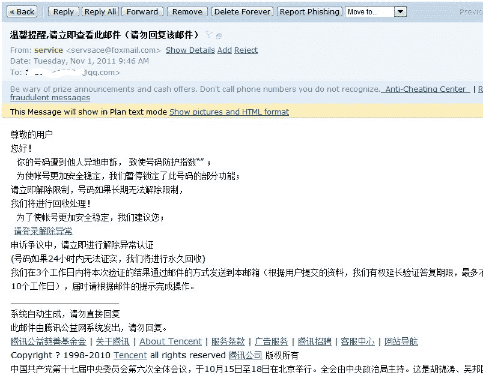
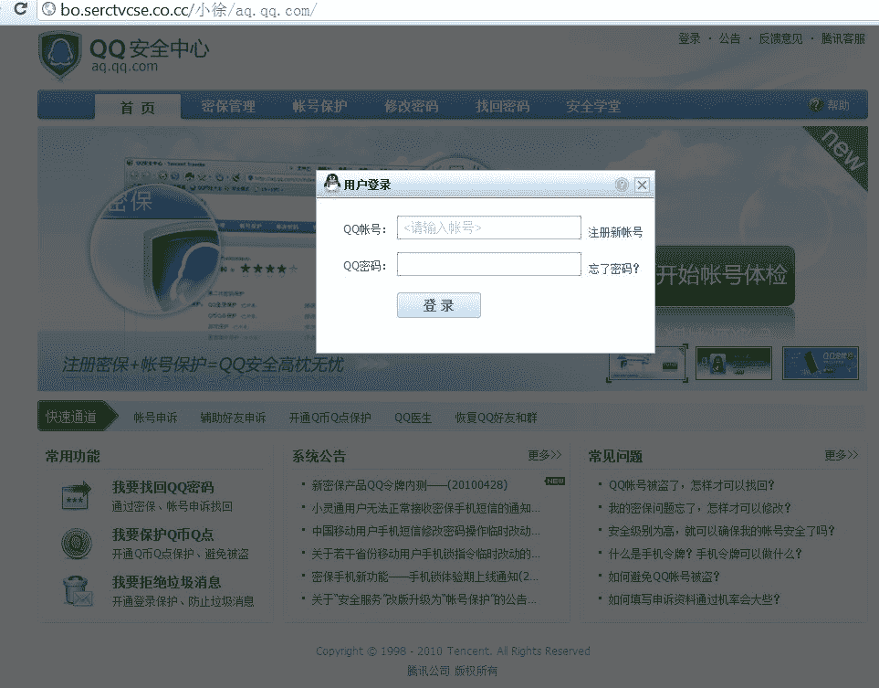

# 新版 QQ 钓鱼邮件

> 原文：[`www.pediy.com/kssd/pediy12/142168.html`](https://www.pediy.com/kssd/pediy12/142168.html)

刚收到一封 QQ 钓鱼邮件
除了伪造的发送地址“service <servsace@foxmail.com>“之外
不同的是其钓鱼链接“请登录解除异常”恶意滥用了 QQ 的 Discuz 云平台重定向服务（hxxp://cp.discuz.qq.com/qun/miniportalRedirect），不明真相的用户更可能被诱导点击并被钓鱼

如果该链接（hxxp://cp.discuz.qq.com/qun/miniportalRedirect/?s_id=7564997&s_site_uid=1&ts=131013449&ADTAG=QQGROUP.MINIPORTAL.SITE.CLICK&auth=g1ZbkFhjpGyquKWuqZukv7FxhWx9d2p0k1pro2lrbm2er6OhmKKivq9vknyBdmlzh1VckVlfW2qXp7WilqyrwMF-g3yBd3Q%3D）被点击，
会被重定向到恶意伪装的 QQ 保护中心
hxxp://bo.serctvcse.co.cc/%E5%B0%8F%E5%BE%90/aq.qq.com/

这个服务器上保存了大量恶意域名，各式钓鱼（网游，网购，网汇，QQ，外挂），甚至还有虚假物流网站
很可能是同一个人或是同一团伙的

blizzararmory.com
blizzarmory.com
btgua.com
etke.tk
ewhe.net
fengsufz.com
fengsujsq.com
paipaipingtai.com
qqucnz.com
sctg518.com
shengfupt.com
taopingpigtai.com
vipx5x.com
w183.com
wangtaopingtai.com
wdwzh.com
wdwzz.com
xgsc518.com
zhongying-express.com

我只简单的查了一下，似乎他的业务已经有 5 年多了，最近一个月特别活跃