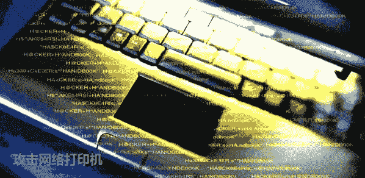

# 攻击网络打印机

> 原文：[`www.pediy.com/kssd/pediy12/116193.html`](https://www.pediy.com/kssd/pediy12/116193.html)

作者：Adrian Crenshaw
译者：riusksk (泉哥：[`riusksk.blogbus.com`](http://riusksk.blogbus.com))

本文已发表于《黑客防线》

你说如果入侵打印机需要何种墨水呢，Irongeek（译注：作者的网站）吗？好的，本文这里将向您讲述如何通过打印机以鲜为人知的方式来渗透网络。以前，除了垃圾箱中的复印件所带来的安全威胁外，并不会有其它太多的安全隐患。但现在的打印机却可通过网络与嵌入式操作系统、存储和 IP 协议栈相关联，已经不再像以前一样单一了。本文将就网络打印机泄漏用户、机主和网络的相关信息的话题展开讨论。
由于本文中关于攻击的内容多于防御，因此看起来有点像黑帽子。但是我觉得这些信息对于系统管理员和审计者来说更为有用，可以帮助他们在面对网络打印机时更清楚地知道该关注哪一方面的信息。关于如何锁住网络打印机，你可以访问厂商的官方网站以获取更多的建议。关于惠普网络打印机的一份指南在本文的底部已经附上下载连接，如果不出意外，本文将引领你在正确的方向上进行思考。
本文测试的打印机主要是基于 Hewlett-Packard LaserJet 4100 MFP (Fax/Printer/Copier/Scanner)，HP Jetdirect 170x 和 HP JetDirect 300X (J3263A)，但与此同时我也将讲述一些关于 Ricoh Savin 打印机的内容，以便让你知道，其实并不是只有惠普的网络打印机才存在安全问题的。本文最初来源于 Droop 的 Infonomicon TV 项目，它如滚雪球一般，没有具体的方向。但我继续坚持着，并对其进行整理，还有其他朋友给予的附加内容和建议，才使得本文更为完善和更有价值。关于本文的最新版本可在以下链接找到：
http://www.irongeek.com/i.php?page=security/networkprinterhacking

下载：
攻击网络打印机.doc