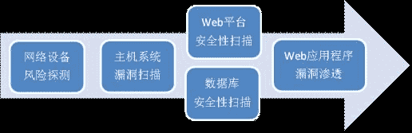

# WEB 网站渗透测试方案

> 原文：[`www.pediy.com/kssd/pediy12/109076.html`](https://www.pediy.com/kssd/pediy12/109076.html)

曾经写过的一个方案。拿出来晒晒。

目录：
WEB 网站渗透测试方案  1
一、 Web 网站渗透测试概述  1
1.1 概述  2
1.2 渗透测试对象  3
1.3 现场安排  4
二、 Web 网站渗透测试技术  4
2.1 网络设备探测  4
2.2 主机系统漏洞扫描  6
2.3Web 平台安全性扫描  8
2.4 数据库系统安全性扫描  10
2.5Web 应用程序渗透测试  11
三、 渗透测试结果归纳  13
3.1 渗透结果分析  13
3.2 渗透测试报告  13

正文：

WEB 网站渗透测试方案

Web 网站渗透测试概述
  Web 安全安全体系木桶原理中最脆弱的缝隙。
  随着互联网的发展，恶意攻击者的目标逐步集中在对 web 网站应用方面的攻击，所以对 web 网站安全的研究也越来越多。控制 Web 应用安全实际上是一个减缓 Web 应用安全风险的过程，这一过程要遵循通用的信息安全风险减缓原则与流程，与网络及系统安全控制不同，Web 应用安全控制主要集中在 Web 应用安全功能设计及实现的风险上，尤其是 Web 应用实现的风险。
  渗透测试可综合评定当前系统各个层面的保护措施可否保护系统免受黑客入侵；可否阻断敏感数据被非法窃取；可否保护机构的公开信息不被恶意攻击者篡改；可否保护机构依赖于网络的业务不会因为黑客的攻击而中断；可否保护机构内部的计算机不会成为黑客攻击和利用的对象。因此对 Web 网站系统进行完整、系统的渗透测试是很有必要的。

1.1 概述
  Web 网站渗透测试主要通过对目标系统信息的全面收集、对系统中网络设备的探测、对服务器主机系统的漏洞扫描、对 Web 平台及数据库系统的安全性扫描以及通过 Web 应用系统程序的安全性渗透测试等手段来完成对整个 Web 网站系统的安全性渗透检测。该渗透测试是一个完整、系统的测试过程，涵盖了网络层面、主机层面、数据库层面以及应用服务层面的安全性渗透测试。技术检测流程如下：

  在具体项目实施中，可根据实际情况对以上流程进行更改，以适应具体系统的实际情况。项目实施流程如下：

1.2 渗透测试对象
网络层渗透测试对象  

表 1 网络层渗透测试对象

主机层渗透测试对象

表 2 主机层渗透测试对象

数据库系统渗透测试对象

表 3 数据系统渗透测试对象

Web 平台渗透测试对象

表 4 Web 平台渗透测试对象

应用层渗透测试对象

表 5 应用层渗透测试对象

1.3 现场安排

序号  工作内容  开始/结束时间  参与人员
  前期调研  （1 天）  
  制定渗透测试方案  （1 天）  
  网络层渗透测试  （1/2 天）  
  主机层渗透测试  （1/2 天）  
  数据库系统渗透测试  （1/2 天）  
  Web 平台渗透测试  （1/2 天）  
  应用层渗透测试  （1/2 天）  
  测试结果分析  （1/2 天）  
  编写渗透测试报告  （1 天）

  表 6 现场工作安排
Web 网站渗透测试技术
  使用相关测试工具对目标系统各个层面进行安全检测，并对工具检测结果进行人工分析、验证，以确保渗透测试结果测准确无误。各个层面渗透测试方法及步骤如下：

2.1 网络设备探测
  检查对象：路由器、交换机、防火墙等网路设备。
  使用工具：XXXXXXXXXXX 等。

2.2 主机系统漏洞扫描
  检查对象：Web 网站系统服务器及数据库服务器。
  使用工具：XXXXXXXXXXXX 等。

2.3Web 平台安全性扫描
  检查对象：IIS、Apache、Tomcat、PHP、Sun Java Web Server 等。
  使用工具：XXXXXXXXXX。

2.4 数据库系统安全性扫描
  检查对象：Oracle、MSSQLServer、MySQL、Sybase 和 IBM DB2。
           使用工具：XXXXXXXXXXXXX 等。

2.5Web 应用程序渗透测试
  检查对象：Web 网站应用程序。
  使用工具：XXXXXXXXXXXXX 等。

渗透测试结果归纳
3.1 渗透结果分析
  通过工具扫描、人工验证，将 Web 网站系统各个层面在设计及实现上的安全弱点或漏洞（即有可能被潜在的威胁源所攻击的系统弱点）汇总并归类。通过人工分析来确定这些弱点被攻击的可能性，以及攻击事件产生影响的大小。
  然后针对各个弱点及漏洞提出了可以用来减缓和消除已识别风险的安全解决方法/方案。这些建议方法/方案的目标是降低 Web 系统的风险级别到一个可接受的水平。应该注意的是，并非所有可能的建议方法/方案都可以被实现来降低损失。针对具体应用要确定哪一个方法/方案是所要求的而且还是适合的，要对被提出的建议方法/方案作一个成本收益分析，从而证明实现这些方法/方案来降低风险级别在成本上是合理的。另外，对引入这些建议方法/方案所带来的操作影响（如对系统性能的影响）和可行性（如技术要求，用户的接受程度）等方面也要仔细分析。 

3.2 渗透测试报告
  渗透测试结束后根据分析状况，描述弱点，改进建议，措施，解决方案，整理完成《XXX 项目渗透检测报告》。

技术部分省略了些核心的东西，大家可以参考参考。

关于技术的部分我会慢慢补充。呵呵