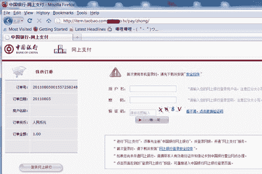
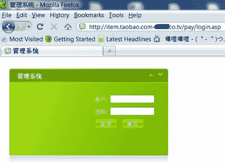
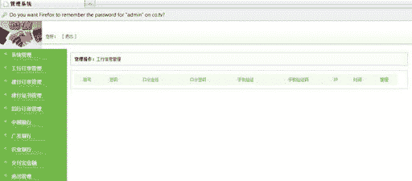
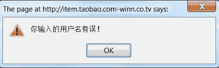
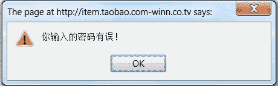
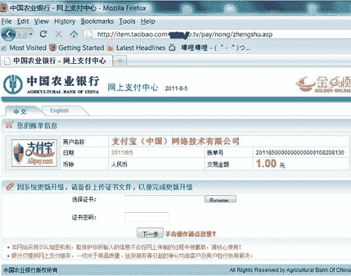
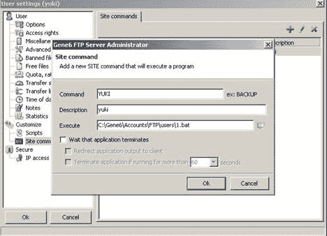
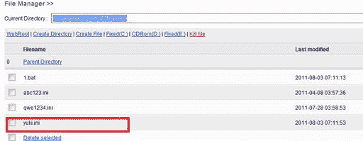

# 对某钓鱼网站的一次渗透 g

> 原文：[`www.pediy.com/kssd/pediy12/138288.html`](https://www.pediy.com/kssd/pediy12/138288.html)

对某钓鱼网站的一次渗透

某天在淘宝上买了点东西，和店主确认几句之后，他发来一个链接，让我去支付。
七转八转来到这个页面:

我看了一下这个网址不对劲，是 http://item.taobao.com-xxxx.co.tv/pay/，莫非我遇上了传说中的淘宝钓鱼？于是立马来了精神，那就顺势检测一下这个钓鱼网站吧。
先试试手气，在网址后面加个 login.asp，居然看到了后台登录页面！

试了几个弱口令和万能密码都无果。但是我发现，当用户名输入”admin”，密码为”123”的时候，提示”你输入的密码有误！”；而用户名输入”123”,密码为”123”时，则提示“你输入的用户名有误！”。 

    **username=”admin”, password=”123”                 

    

     username=”123”, password=”123”**
于是尝试有户名”admin’ or ‘’=’ ”，密码为”123”，结果提示”你输入的密码有误！”。于是可以推断用户名字段存在注入。
于是整理了一下 url:
” http://item.taobao.com-xxxx.co.tv/pay/login.asp?action=check&password=123&username=admin”, 但是用了几个工具都扫不出来，没办法手工注吧，一阵痛苦后，得到表名”admin”，列名”username”,”password”，然后猜解数据，密码是明文的，直接登录后台成功。
邪恶的钓鱼后台是长这个样子的:

在里面乱翻一阵后，发现这个后台主要是浏览功能，没什么可以上 webshell 的地方，于是继续回到前台看看有没有可以上传的地方。工夫不负有心人，终于在一个农行的支付页面出找到一个上传证书的地方:

直接上传.asp 文件失败，想了想，既然是要上传证书，那就把 asp 小马的后缀改成.cer 来试试，这次上传成功了。再跑到后台找的刚刚上传的证书的 URL, 访问以下，看到可爱的小马了。于是大手牵小手，小马拉大马，至此渗透第一步结束，拿到 webshell

Gene FTP 提权

拿到 webshell 后看了一下，支持 aspx，权限还是挺大的，很多目录都可以浏览。那就顺便提个权吧。。。
列了一下进程，发现主机上的程序很少，没有 MSSQL, 没有 MySql，连杀毒软件都没有。FTP 是 Gene6 FTP，就用它提权好了。网上有一篇讲用 Gene FTP 提权的:
http://hi.baidu.com/hackxiaolong/blog/item/b99c4c67c676ad2aab184cb4.html,  这篇是别人百度空间转的，原作者是 “晓华[岁月联盟]”，不过他的 blog 我访问不了了，找不到原来的出处，只能发转载的，在此向作者表示一下歉意。
文章中的做法比较复杂，需要转发端口。但是我的网络环境无法配置端口转发，所以我自己装了个 Gene6 ftp 研究了一下， 找到一个比较简单的操作方法，前提是 gene 的用户配置文件目录可写，在这个例子里是” C:\Gene6\Accounts\domain1\users\”目录。
具体操作方法：
首先在本地创建一个用户，用户名”yuki”，然后在 site command 里添加一个命令,命令名叫”YUKI”，路径处填”C:\gene6\accounts\ftp\users\1.bat”(这个路径随意，只要把到时候在提权主机上建立相应的 bat 文件即可) 

然后找到用户”yuki”的配置文件”yuki.ini”，直接上传到提权主机的用户配置文件目录下面:

同时创建 1.bat 文件，内容为加一个账户 yuki:
net user yuki yuki /add
net localgroup administrators yuki /add

然后直接命令行连接目标机的 ftp，使用用户 yuki 登录，然后执行命令: “quote site YUKI”，直接 3389 远程登录，上去一看，乖乖，这个机子 host 了几十个淘宝钓鱼的域名，可谓是个“钓鱼老巢”了:

整个过程没什么技术含量，大家随便看看。
最后想对大家说一句的是，大家上网买东西一定要当心，这年头骗子多，要注意安全 